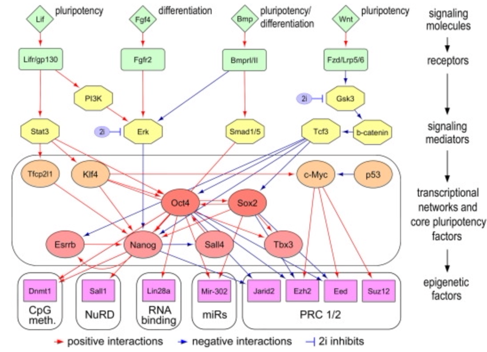

```{r setup, include=FALSE}
knitr::opts_chunk$set(echo = TRUE)
```

# Background and purpose

Transcriptional regulation orchestrates gene activity through the regulation of the DNA to RNA conversion process. This form of regulation is crucial to all living organisms. It is organised by transcription factors, who, along with other factors, in concert drive mRNA expression for an organism. These processes have wide-reaching, important implications, as distinct transcriptional networks drive development, lineage specification, and cell fate decisions during early embryonic development [@theunissenMechanismsGeneRegulation2017]. Recent advances in -omics technologies have made it possible to profile genome-wide transcriptional and epigenetic events for investigating transcriptional networks. As a result, a key goal of modern computational -omics work is to identify the target genes of transcription factors that drive key transcriptional events over a course of time. This report seeks to extend this goal by constructing a classification pipeline which uses -omics information (transcriptomics, proteomics, and epigenomics) to predict whether a target gene belongs to two important transcription factors (or not): SOX2 and NANOG. SOX2 is a key transcription factor for maintaining pluripotency (a cell's ability to differentiate into other cell types) of undifferentiated embryonic stem cells. NANOG also helps embryonic stem cells maintain pluripotency, but does so through the suppression of cell determination factors.

The following code excerpt loads the dataset and the relevant R packages to reproduce the work presented here (see end of the report for a full session information print out):

```{r, message = FALSE, warning = FALSE}
# Read in data and load R packages

load("Final_Project_ESC.RData", verbose = TRUE)
library(tibble)
library(dplyr)
library(tidyr)
library(purrr)
library(ggplot2)
library(ggrepel)
library(GGally)
library(patchwork)
library(broom)
library(factoextra)
library(caret)
library(sp)
library(MLeval)
```

# Exploratory data analysis

Exploratory data analysis was performed to understand the three datasets avilable to us: (i) transcriptome; (ii) proteome; and (iii) epigenome (of which there are six separate histone mark datasets). The purpose of this analysis was to understand the role of the time-course differentiation variables across each data type, as these variables will be used to train classification algorithms later in this paper. We will explore each of the datasets in turn.

## Transcriptome

The transcriptome dataset contains $19,788$ unique genes, each sampled across 8 timepoints: 0hr (stem cells prior to differentiation stimulation), 1hr, 6hr, 12hr, 24hr, 36hr, 48hr, and 72hr. Figure \@ref(fig:transPairs) below plots univariate and pairwise statistics for each time-course differentiation variable in the dataset. From a univariate perspective, we see roughly leptykurtic Gaussian distributions of values, except for the `0hr` timepoint, where we see smaller peaks symmetrically on either side of the mode. From a pairwise perspective, apart from all relationships involving `0hr`, we see roughly positive linear relationships, with the linearity becoming stronger between later timepoints. Notably, the pairwise relationships between `0hr` and all other timepoints appear discretised, and `1hr` and all other timepoints are positive linear but with heteroskedasticity.

```{r transPairs, message = FALSE, warning = FALSE, fig.width = 7, fig.height = 5, fig.cap = "Univariate and pairwise statistics of each time-course differentiation in the transcriptome dataset."}
ggpairs(as.data.frame(Transcriptome)) +
  theme(axis.text.x = element_text(angle = 90, hjust = 1))
```

With such a large multivariate dataset, it is important to go beyond univariate and pairwise relationships to understand the multivariate structure of the data, particularly in an interpretable lower dimensional space. As a preliminary analysis, we seek to understand whether there is visual distinction between the time points. The code below defines a reusable function for computing a pairwise correlation matrix between each timepoint, computing a principal components analysis (PCA) on the correlation matrix, and then plotting the projection of the PCA into two dimensions as a scatterplot (as shown in Figure \@ref(fig:transPCA)). We can see a clear anti-clockwise trajectory of increasing time, with each positioned in its own region of space along this pattern. We also find that the first principal component (PC) explains $59.25\%$ of the variance in the correlation matrix data, while the second PC explains $31.61\%$, for a combined total of $90.68\%$ --- highlighting the dominance of these two PCs relative to the remaining six. As such, the dimensionality of the transcriptome dataset could be reduced substantially by using the PCs.

```{r transPCA, message = FALSE, warning = FALSE, fig.width = 6, fig.height = 4, fig.cap = "Low dimensional projection of transcriptome time-course differentation using PCA."}
#' Function to calculate PCA and return useful outputs for an input matrix
#' @param matrix the input data matrix
#' @param subtitle string for the plot subtitle. Defaults to \code{NULL} for no subtitle
#' @return an object of class \code{list}
#' 

do_pca <- function(matrix, subtitle = NULL){
  
  # Fit PCA on correlation matrix
  
  cors <- cor(matrix)
  fits <- stats::prcomp(cors, scale = TRUE)
  
  # Retrieve eigenvalues and tidy up variance explained for first 2 PCs for plotting
      
  eigens <- fits %>%
    tidy(matrix = "eigenvalues") %>%
    filter(PC %in% c(1, 2)) %>% # Filter to just the 2 going in the plot
    select(c(PC, percent)) %>%
    mutate(percent = paste0("(", round(percent * 100, digits = 2), "%)")) # Make nice format
  
  # Draw plot
        
  p <- fits %>%
    augment(cors) %>%
    mutate(.rownames = as.factor(.rownames),
           .rownames = gsub(".*_", "\\1", .rownames)) %>%
    ggplot(aes(x = .fittedPC1, y = .fittedPC2)) +
    geom_point(size = 3, ggplot2::aes(colour = .rownames)) +
    geom_text_repel(aes(label = .rownames)) +
    labs(x = paste0("PC 1 ", eigens$percent[1]),
         y = paste0("PC 2 ", eigens$percent[2]),
         caption = "Variance explained by each PC is shown in parentheses.") +
    scale_fill_brewer(palette = "Dark2") +
    theme_bw() +
    theme(legend.position = "none")
  
  if(!is.null(subtitle)){
    p <- p +
      labs(subtitle = subtitle,
           caption = NULL)
  }
  
  mylist <- list(fits, p)
  names(mylist) <- c("fits", "p")
  return(mylist)
}

# Run function

transcriptome_pca <- do_pca(matrix = Transcriptome)
print(transcriptome_pca$p)
```

## Proteome

To first understand this dataset, we plotted the univariate and pairwise statistics (shown in Figure \@ref(fig:protPairs)). Again, from a univariate perspective, we see roughly leptykurtic Gaussian distributions of values. From a pairwise perspective, we see roughly positive linear relationships with heteroskedasticity, with the linearity becoming stronger between later timepoints.

```{r protPairs, message = FALSE, warning = FALSE, fig.width = 7, fig.height = 5, fig.cap = "Univariate and pairwise statistics of each time-course differentiation in the proteome dataset."}
ggpairs(as.data.frame(Proteome))
```

Applying the function defined earlier for the transcriptome case, but with the proteome input data, we can again in Figure \@ref(fig:protPCA) below see a clear anti-clockwise trajectory of increasing time, with each positioned in its own region of space along this pattern. We also find that the first principal component (PC) explains a similarly large percentage of the variance in the correlation matrix data ($61.31\%$), while the second PC explains $26.44\%$, for a combined total of $87.75\%$ --- another strong result for just two PCs. This, again, suggests that the dimensionality of the proteome dataset could be reduced using PCs.

```{r protPCA, message = FALSE, warning = FALSE, fig.width = 6, fig.height = 4, fig.cap = "Low dimensional projection of proteome time-course differentation using PCA."}
proteome_pca <- do_pca(matrix = Proteome)
print(proteome_pca$p)
```

Evidently, time courses across both transcriptomic and proteomic structures appear to be differentiated in a low dimensional space of the first two PCs. However, it remains unclear whether each PC is driven by one or more time courses. Examining the variable loadings for the PCA can reveal this information, which is plotted below in Figure \@ref(fig:protTransLoad). Here, we see for both transcriptome and proteome, that multiple variables (i.e., time courses) contribute meaningfully to each principal component --- especially the first two which are of primary interest to us. This means that if further analysis uses PCs as inputs instead of the raw time course data, any model would not simply be learning on time courses that loaded singularly onto each PC. However, we do see that very strong loadings exist for the 48hr time course onto the second-last PCs in both cases (PC 7 for transcriptome and PC 6 for proteome), which is interesting. Further, we see the earliest (0hr for transcriptome, 1hr for proteome) and latest (72hr for both datasets) time courses exhibit very strong loading onto the final PC in both cases --- which potentially highlights the heterogeneity of these two time points relative to the rest. 

```{r protTransLoad, message = FALSE, warning = FALSE, fig.width = 7, fig.height = 4, fig.cap = "Variable loadings onto principal components for transcriptome and proteome datasets."}
#' Function to plot factor loadings for PCA
#' @param pca the model output object from \code{prcomp}
#' @param subtitle string specifying the subtitle of the plot
#' @return object of class \code{ggplot}
#' 

plot_loadings <- function(pca, subtitle){
  
  # Extract variable loadings
  
  contribs <- get_pca_var(pca)
  loadings_plot <- as.data.frame(contribs$contrib)
  n_vars <- ncol(loadings_plot)
  
  # Generate labels for plot programmatically
  
  fac_levs <- rep(NA, length.out = n_vars)
  
  for(i in 1:n_vars){
    fac_levs[i] <- paste0("PC ", i)
  }
  
  time_levs <- rownames(loadings_plot)
  
  # Draw plot
  
  loadings_plot <- loadings_plot %>%
    rownames_to_column(var = "timepoint") %>%
    pivot_longer(cols = 2:(n_vars + 1), names_to = "names", values_to = "value") %>%
    mutate(names = gsub("Dim.", "PC ", names)) %>%
    mutate(names = factor(names, levels = fac_levs),
           timepoint = factor(timepoint, levels = time_levs)) %>%
    ggplot(aes(x = names, y = timepoint, fill = value))  +
    geom_tile() +
    labs(subtitle = subtitle,
         x = "Principal component",
         y = "Variable",
         fill = "Component loading") +
    scale_fill_viridis_c(option = "plasma") +
    theme_bw() + 
    theme(axis.text.x = element_text(angle = 45, hjust = 1),
          axis.ticks.y = element_blank(),
          legend.position = "bottom",
          panel.grid.minor = element_blank())
  
  return(loadings_plot)
}

# Use functions to draw plots

transcriptome_load <- plot_loadings(pca = transcriptome_pca$fits, subtitle = "Transcriptome")
proteome_load <- plot_loadings(pca = proteome_pca$fits, subtitle = "Proteome")
patchwork::wrap_plots(transcriptome_load, proteome_load, ncol = 2, nrow = 1)
```

## Epigenome

The transcriptome and proteome data contained a single matrix each. However, for the epigenome data, there are six different histone marks (H3K4me3, H3K27me3, Pol2, H3K4me1, H3K27ac, and H3K9me2), with a separate matrix for each, whose values are all in a different scale. For brevity, we have omitted the pairs plots for each histone mark, but the analysis again showed positive linear associations between each timepoint, however, we also observed right-skewed Gamma distributions of values in the univariate setting. Since an interpretable low dimensional projection is of primary interest to us, we performed the same PCA analysis for each histone mark (as shown in Figure \@ref(fig:epiPCA)). Similar results are found for the epigenome, with the first two PCs almost all the variance across all six histone marks, with notable results including the $82.4\%$ variance explained by PC 1 alone for H3K4me3, and the lowest variance explained by a PC 1 ($52.44\%$) for Pol2.

```{r epiPCA, message = FALSE, warning = FALSE, fig.width = 12, fig.height = 8, fig.cap = "Low dimensional projection of epigenome time-course differentation using PCA."}
epigenome_list <- list(H3K27ac, H3K27me3, H3K4me1, H3K4me3, H3K9me2, PolII)
epi_names <- c("H3K27ac", "H3K27me3", "H3K4me1", "H3K4me3", "H3K9me2", "PolII")
names(epigenome_list) <- epi_names
epigenomes <- purrr::map2(.x = epigenome_list, .y = epi_names, ~ do_pca(matrix = .x, subtitle = .y))
plots <- list(epigenomes$H3K27ac$p, epigenomes$H3K27me3$p, epigenomes$H3K4me1$p, epigenomes$H3K4me3$p, epigenomes$H3K9me2$p, epigenomes$PolII$p)

patchwork::wrap_plots(plots, ncol = 3, nrow = 2) +
  patchwork::plot_annotation(caption = "Variance explained by each PC is shown in parentheses.")
```

We can similarly explore the variable loadings for the PCA models for the epigenome data. In Figure \@ref(fig:epiLoad) below, we see that across the six histone marks, the first two PCs are typically characterised by loadings from multiple time course variables --- suggesting their suitability as inputs for modelling. However, we do also see that very strong loadings of a single time course onto a range of PCs are visible, such as for H3K4me1, where 24hr loads strongly onto PC 2, 0hr onto PC 4, 1hr onto PC 7, and 72 hr onto PC 8.

```{r epiLoad, message = FALSE, warning = FALSE, fig.width = 12, fig.height = 8, fig.cap = "Variable loadings onto principal components for epigenome datasets across six histone marks."}
epigenome_pc_list <- list(epigenomes$H3K27ac$fits, epigenomes$H3K27me3$fits, epigenomes$H3K4me1$fits, 
                          epigenomes$H3K4me3$fits, epigenomes$H3K9me2$fits, epigenomes$PolII$fits)

names(epigenome_list) <- epi_names
epigenome_loads <- purrr::map2(.x = epigenome_pc_list, .y = epi_names, ~ plot_loadings(pca = .x, subtitle = .y))
patchwork::wrap_plots(epigenome_loads, ncol = 3, nrow = 2)
```

## Construction of combined dataset

Prior work transformed both the transcriptome and proteome datasets to be in a comparable scale --- meaning they can be easily appended to form a combined dataset. We can combine the two based on only the consistent genes across both datasets:

```{r, message = FALSE, warning = FALSE}
Proteome2 <- as.data.frame(Proteome)
colnames(Proteome2) <- paste0("p_", colnames(Proteome2))
Proteome2 <- rownames_to_column(.data = Proteome2, var = "gene")
Transcriptome2 <- as.data.frame(Transcriptome)
colnames(Transcriptome2) <- paste0("t_", colnames(Transcriptome2))
Transcriptome2 <- rownames_to_column(.data = Transcriptome2, var = "gene")

prot_trans_df <- Proteome2 %>%
  inner_join(Transcriptome2, by = c("gene" = "gene")) %>% # Ensures we retain only common genes
  mutate(label = ifelse(gene %in% OSN_target_genes_subset, "OSN", "Other"),
         label = as.factor(label))
```

However, it is noted that there is a substantial imbalance between the classes, with $N = 95$ OSN genes and $N = 8260$ Other genes. As such, a method for reducing the severe class imbalance was devised. First, we fit a PCA to the combined Transcriptome/Proteome dataset for the Other genes only. We then used the values for each principal component as input to a set of nine $k$-means clustering models to uncover structure in the data --- where $k$ ranged from $k = 1$ to $k = 9$. Figure \@ref(fig:kCluster) plots the results for each of the nine $k$-means models where each point is shaded by its assigned cluster. While increasing $k$ clearly adds sophistication and nuance, it does so at the expense of parsimony and sample size per cluster.

```{r kCluster, message = FALSE, warning = FALSE, fig.width = 6, fig.height = 7, fig.cap = "Plot of nine k-means clustering models fit to the first two principal components of 'Other' genes in the combined Transcriptome/Proteome dataset."}
# Filter to "Other" genes

prot_trans_other <- prot_trans_df %>%
  tibble::column_to_rownames(var = "gene") %>%
  filter(label == "Other") %>%
  dplyr::select(-c(label))

# Fit PCA

osn_pca <- stats::prcomp(prot_trans_other, scale = TRUE)

osn_pca_df <- osn_pca %>%
  augment(prot_trans_other) %>%
  dplyr::select(c(.fittedPC1:.fittedPC15))

rownames(osn_pca_df) <- rownames(prot_trans_other)

# Fit 9 candidate k-means

kclusts <- 
  tibble(k = 1:9) %>%
  mutate(
    kclust = purrr::map(k, ~ kmeans(osn_pca_df, .x)),
    tidied = purrr::map(kclust, tidy),
    glanced = purrr::map(kclust, glance),
    augmented = purrr::map(kclust, augment, osn_pca_df)
  )

# Extract summaries for each model

assignments <- kclusts %>% 
  unnest(cols = c(augmented))

clusterings <- kclusts %>%
  unnest(cols = c(glanced))

# Draw plot summarising each point's position in low dimensional space coloured by cluster

kplots <- ggplot(assignments, aes(x = .fittedPC1, y = .fittedPC2)) +
  geom_point(aes(color = .cluster), alpha = 0.6) + 
  labs(x = "PC 1",
       y = "PC 2",
       colour = "Cluster") +
  facet_wrap(~ k) +
  theme_bw() +
  theme(legend.position = "bottom",
        strip.background = element_blank())

print(kplots)
```

We then inspected the elbow plot produced by graphing the number of clusters $k$ against the total within sums of squares for each model (see Figure \@ref(fig:kElbow)). Evidently, a bend is visible from $k = 3$, however, $k = 4$ was selected for two reasons: (i) a marked reduction in within sums of squares was noted but a relatively lesser improvement for $k = 5$ was noted; and (ii) visually, $k = 4$ looked appropriate in Figure \@ref(fig:kCluster) in terms of parsimony and ensuring appropriate nuance.

```{r kElbow, message = FALSE, warning = FALSE, fig.width = 6, fig.height = 4, fig.cap = "Elbow plot of nine k-means clustering models. A k value of three of four is the ideal tradeoff between parsimony and sufficient complexity."}
k_elbow <- ggplot(clusterings, aes(k, tot.withinss)) +
  geom_line() +
  geom_point() +
  labs(x = "k",
       y = "Total within sums of squares") +
  scale_x_continuous(breaks = seq(from = 1, to = 9, by = 1)) +
  theme_bw() +
  theme(panel.grid.minor = element_blank())

print(k_elbow)
```

Guided by the $k$-means results, we then generated the final list of Other genes to use when training the classification models. This involved drawing $5\%$ of samples from each cluster. This produced a final number of $n = 410$ Other genes, and a ratio of $4.3$ Other genes to every $1$ OSN gene ($n = 95$ total). While still imbalanced, the magnitude of the original $87:1$ imbalance is substantially reduced without under-sampling the smaller clusters identified above.

``````{r, message = FALSE, warning = FALSE}
# Filter to optimal solution and add back to gene list

opt_k <- assignments %>%
  filter(k == 4) %>%
  dplyr::select(.fittedPC1:.fittedPC15, .cluster)

other_genes <- osn_pca_df %>%
  left_join(opt_k) %>%
  mutate(gene = rownames(osn_pca_df))

# Draw random samples from each cluster

#' Draw time series plots by class
#' @param data the dataframe containing time series data
#' @param cluster the cluster to draw samples for
#' @param p proportion of samples to take
#'

draw_samples <- function(data, cluster, p){
  set.seed(123)
  
  samps <- data %>%
    filter(.cluster == cluster) %>%
    dplyr::select(gene) %>%
    distinct() %>%
    pull(gene)
  
  samps <- samps %>%
    sample(size = (floor(p * length(samps))))

  return(samps)
}

other <- unique(other_genes$.cluster) %>%
  purrr::map(~ draw_samples(data = other_genes, cluster = .x, p = .05)) %>%
  unlist()

# Subset original proteome/transcriptome dataset

keeper_genes <- append(prot_trans_df[prot_trans_df$label == "OSN", 1], other)

prot_trans_df <- prot_trans_df %>%
  filter(gene %in% keeper_genes)
```

Preparation of the epigenome datasets according to the filtering of Other genes was also performed separately for each of the six histone marks:

```{r, message = FALSE, warning = FALSE}
#' Function to prepare histone mark data for modelling
#' @param X the data matrix
#' @param keepers vector of genes to keep if \code{cm = FALSE}
#' @param cm \code{Boolean} whether to label based on subset (for training) or not (for predictive evaluation). Defaults to \code{FALSE}
#' @return an object of class \code{data.frame}
#' 

prepare_histone_df <- function(X, keepers, cm = FALSE){
  
  X1 <- as.data.frame(X) %>%
  tibble::rownames_to_column(var = "gene")
  
  if(cm){
    X1 <- X1 %>%
      mutate(label = ifelse(gene %in% OSN_target_genes, "OSN", "Other"),
             label = as.factor(label))
  } else{
    X1 <- X1 %>%
      filter(gene %in% keepers) %>%
      mutate(label = ifelse(gene %in% OSN_target_genes_subset, "OSN", "Other"),
             label = as.factor(label))
  }
  
  return(X1)
}

H3K27ac_df <- prepare_histone_df(H3K27ac, keepers = keeper_genes, cm = FALSE)
H3K27me3_df <- prepare_histone_df(H3K27me3, keepers = keeper_genes, cm = FALSE)
H3K4me1_df <- prepare_histone_df(H3K4me1, keepers = keeper_genes, cm = FALSE)
H3K4me3_df <- prepare_histone_df(H3K4me3, keepers = keeper_genes, cm = FALSE)
H3K9me2_df <- prepare_histone_df(H3K9me2, keepers = keeper_genes, cm = FALSE)
PolII_df <- prepare_histone_df(PolII, keepers = keeper_genes, cm = FALSE)
```

## Gene classification

Following exploratory data analysis, a set of seven predictive models for identifying whether a gene is a target of the two transcription factors of interest (SOX2 and NANOG) or not was constructed (one model for each dataset --- the combined proteome/transcriptome dataset and the six individual histone marks). The type of classification model that was chosen is a Gaussian process (GP) with an exponentiated-quadratic kernel/covariance function (also known as a "radial basis function" or "squared exponential"). Recall that a Gaussian distribution is parameterised by two scalar values: (i) mean $\mu$; and (ii) variance $\sigma^{2}$ (or the standard deviation which is the square root of the variance). We can write it as $\mathcal{N}(\mu, \sigma^{2})$. We can increase the dimensionality of this univariate case to describe *multivariate Gaussian distributions*, by increasing the dimensionality of the parameters. This results in the mean becoming a *mean vector* $\mu$ and the variance becoming a *covariance matrix* $\Sigma$ (as we now need to describe both the variance of each variable and the covariance between them), written as $\textbf{X} \sim \mathcal{N}(\mu, \Sigma)$. A GP is a generalisation of this idea to an infinite number of dimensions. This means the mean vector and covariance matrix now become a *mean function* $m(x)$ and *covariance function* $k(x, x')$ (also called a "kernel"). Putting this together, we can define a GP as:

$$
f(x) = \mathcal{GP}(m(x), k(x, x'))
$$

The most common covariance function is the exponentiated-quadratic, which we apply here. This function forms the basis for simpler kernel-based machine learning techniques, such as support vector machines. One of the reasons for its popularity is that it looks quite similar to the formula for a univariate Gaussian distribution. It is mathematically defined as:

$$
k(x, x') = \text{exp} \left( -\frac{1}{2\sigma^{2}}||x - x'||^{2} \right)
$$

where where $\sigma^{2}$ is the variance (average distance of a function away from its mean) and $\mathcal{l}$ is the lengthscale (the length of the "wiggles" in a function). These are *hyperparameters* that can be set or learnt to control the shape of the kernel. To implement this model in R, we make use of the `caret` package for machine learning which enables usage of an RBF GP through the model labelled `"gaussprRadial"`. Below, we define a function for training such a model using $10$-fold cross-validation, and run it for each of the seven datasets separately.

```{r, message = FALSE, warning = FALSE}
#' Do 10-fold CV to train a machine learning model
#' @param data \code{data.frame} of input data
#' @param model string of the \code{caret} model to use. Defaults to \code{"gaussprRadial"}
#' @param seed fix R's pseudo-random number generator for reproducibility. Defaults to \code{123}
#' @return object of class \code{list} containing \code{caret} model information
#' 

fit_model <- function(data, model = "gaussprRadial", seed = 123){
  
  set.seed(seed)
  
  # Remove "gene" column as it will mess with model
  
  data2 <- data %>%
    dplyr::select(-c(gene))
  
  # Fit model
  
  fit <- caret::train(label ~ .,
                      data = data2,
                      method = model,
                      trControl = caret::trainControl(method = "cv", number = 10, classProbs = TRUE),
                      preProcess = c("center", "scale"),
                      summaryFunction = twoClassSummary)
  
  return(fit)
}

# Run the function for all datasets

models <- list()
model_dfs <- list(prot_trans_df, H3K27ac_df, H3K27me3_df, H3K4me1_df, H3K4me3_df, H3K9me2_df, PolII_df)

for(i in 1:length(model_dfs)){
  themod <- fit_model(data = model_dfs[[i]], model = "gaussprRadial", seed = 123)
  models[[i]] <- themod
}

names(models) <- c("prot_trans_df", "H3K27ac_df", "H3K27me3_df", "H3K4me1_df", "H3K4me3_df", "H3K9me2_df", "PolII_df")
```

### Comparison to benchmark results

With the seven models now trained, we moved to evaluating each model's ability to predict gene class of the whole list of OSN target genes and not just the subset which formed the basis of the data to train each model. We also used the full set of Other genes in this comparison for an exhaustive evaluation. Performance for binary classification problems can be quantified through different metrics obtained via calculations on the confusion matrix --- a matrix which cross-tabulates frequencies of model predictions against the actual class labels. The confusion matrix (for a two-class problem) returns four potential mutually-exclusive, collectively-exhaustive values: (i) true positive (TP); (ii) false positive (FP); (iii) false negative (FN); and (iv) true negative (TN). We summarise each model's predictive performance of the full gene set using four specific metrics calculated from the confusion matrix:

1. Accuracy $= \frac{\text{TP} + \text{TN}}{\text{TP} + \text{FP} + \text{FN} + \text{TN}}$
3. Sensitivity $= \frac{\text{TP}}{\text{TP} + \text{FN}}$
4. Specificity $= \frac{TN}{\text{FP} + \text{TN}}$
2. Balanced Accuracy $= \frac{\text{sensitivity} + \text{specificity}}{2}$

The code below produces Table \@ref(tab:performance), which compares each model on these performance metrics.

```{r, message = FALSE, warning = FALSE, eval = FALSE}
# Prepare evaluation datasets

prot_trans_df2 <- Proteome2 %>%
  inner_join(Transcriptome2, by = c("gene" = "gene")) %>% # Ensures we retain only common genes
  mutate(label = ifelse(gene %in% OSN_target_genes, "OSN", "Other"),
         label = as.factor(label))

H3K27ac_df2 <- prepare_histone_df(H3K27ac, cm = TRUE)
H3K27me3_df2 <- prepare_histone_df(H3K27me3, cm = TRUE)
H3K4me1_df2 <- prepare_histone_df(H3K4me1, cm = TRUE)
H3K4me3_df2 <- prepare_histone_df(H3K4me3, cm = TRUE)
H3K9me2_df2 <- prepare_histone_df(H3K9me2, cm = TRUE)
PolII_df2 <- prepare_histone_df(PolII, cm = TRUE)
eval_dfs <- list(prot_trans_df2, H3K27ac_df2, H3K27me3_df2, H3K4me1_df2, H3K4me3_df2, H3K9me2_df2, PolII_df2)

# Compute performance metrics for each model/dataset

metrics <- list()
rocplots <- list()

for(i in 1:length(models)){
  
  pred_data <- eval_dfs[[i]] %>% dplyr::select(-c(gene)) # Remove gene column to avoid model errors
  pred <- predict(models[[i]], newdata = pred_data, type = "prob") # Generate predictions
  pred <- pred %>% mutate(predicted_label = ifelse(pred[1] > pred[2], colnames(pred)[1], colnames(pred)[2]))
  pred <- pred %>% rename(predicted_label = 3)
  pred <- pred %>% mutate(predicted_label = as.factor(predicted_label))
  cm <- caret::confusionMatrix(pred$predicted_label, pred_data$label) # Confusion matrix
  
  results <- data.frame(Model = ifelse(i == 1, "Proteome + Transcriptome", paste0("Epigenome (", gsub("_df", "\\1", names(models)[i]), ")")),
                        Accuracy = round(cm$overall[1], digits = 3),
                        `Balanced Accuracy` = round(cm$byClass[11], digits = 3),
                        Sensitivity = round(cm$byClass[1], digits = 3),
                        Specificity = round(cm$byClass[2], digits = 3)) # Summarise performance
  
  metrics[[i]] <- results
  
  # Draw ROC curve
  
  pred <- predict(models[[i]], newdata = pred_data, type = "prob")
  roc_p <- MLeval::evalm(data.frame(pred, pred_data$label, Group = "OSN"))$roc

  roc_p <- roc_p +
    labs(subtitle = results$Model) +
    theme_bw() +
    theme(legend.position = "bottom")

  rocplots[[i]] <- roc_p
}

# Bind results and present table

all_metrics <- do.call(rbind, metrics) %>% arrange(-`Balanced.Accuracy`)
rownames(all_metrics) <- NULL
knitr::kable(all_metrics, caption = "Summary of predictive performance of all models.")
```

```{r performance, message = FALSE, warning = FALSE, echo = FALSE}
load("all_metrics.Rda")
knitr::kable(all_metrics, caption = "Summary of predictive performance of all models.")
```

We find that overall, all models can classify the larger unseen gene list with far accuracy above the chance probability of $0.5$, with no model in fact dropping below $0.9$. However, this result is misleading due to the severe class imbalance. Observing the balanced accuracy scores, we see that they range from $0.515-0.613$, highlighting the fact that erroneously high raw accuracy can be achieved by assigning class labels to the majority class (specificity). Indeed, the specificity scores for each model were high, ranging from $0.966-0.994$. As expected, the sensitivity values (how well each model classified OSN genes) were all relatively low, with the best performing model in terms of balanced accuracy --- the epigenome histone mark H3K27ac ($0.613$ balanced accuracy) --- achieving the highest sensitivity value ($0.245$). Collectively, these results highlight that a relatively small number of time-course differentiation variables ($8-15$) can predict whether a gene is SOX2 or NANOG target with about chance balanced accuracy.

We also examined receiver operating characteristic curves (ROC) for each model's predictive performance, which plots the false positive rate against the true positive rate (presented in Figure \@ref(fig:rocPlots) below). Ideally, the curve should have an inflection point as close to the top left corner as possible, where inflection in this corner signifies perfect classification accuracy. Consistent with the performance summary table presented in Table \@ref(tab:performance) above, we find that the epigenome histone mark H3K27ac exhibits the most desirable ROC curve. This was further supported numerically, as this histone demonstrated the largest area-under-the-curve of $AUC = 0.87$, closely followed by the POLII histone mark at $AUC = 0.85$.

```{r, message = FALSE, warning = FALSE, echo = FALSE}
load("rocplots.Rda")
```

```{r rocPlots, message = FALSE, warning = FALSE, fig.width = 11, fig.height = 8, fig.cap = "ROC plots for predictive performance on entire gene set for the seven different models that were fit."}
rocs <- patchwork::wrap_plots(rocplots, ncol = 4, nrow = 3)
print(rocs)
```

## Discussion

Our classification models have proven to be an effective method for predicting the target genes of transcription factors SOX2 and NANOG, however, considering the scope of the molecular interactions occurring to maintain human embryonic stem cell pluripotency, there are several limitations that need to be addressed. These limitations hold implications for the interpretation of the lower balanced accuracy, specificity, and sensitivity values. While SOX2, NANOG, and OCT4 are the primary transcription factors in pluripotency regulation, there are still several missing components excluded from our model that need to be considered such as photoproteomes and other transcription factors, such as OCT4, SOX3, ESRRB and many more [@10.1634/stemcells.22-1-51]. These excluded components interplay with the binding of SOX2 and NANOG to target genes, as transcription factors affect the upregulation and downregulation of each other over differentiation and self-renewal periods, as seen in Figure \@ref(fig:pluri) [@PAPATSENKO2018180].

```{r pluri, echo = FALSE, fig.cap = "Transcription factor regulation over differentiation and self-renewal periods. Source: Papatsenko, Waghray, and Lemischka (2018)."}

```

Moreover, our results indicated that the combined transcriptome/proteome dataset performed the best compared to the epigenome datasets, which may be attributed to the differences in the role transcription factors play in transcriptional and epigenetic regulation of stem cell gene expression. This highlights a series of challenges relating to determining how the interactions between epigenomic features and transcription factors correspond to maintaining pluripotency [@atlasiInterplayEpigeneticMarks2017]. One such challenge is the fact that transcription factors can interact with DNA methyltransferases to promote site-specific DNA methylation and histone modification to maintain stem cell pluripotency, rather than the transcription factor directly binding to the target gene [@gibneyEpigeneticsGeneExpression2010a]. Thus, our models can be further developed by accounting for missing or unknown data, such as the interplay between the transcription factors and epigenomic dynamics, which may be corrected by gene expression and sequencing technologies as they become more advanced.

# SessionInfo

```{r}
sessionInfo()
```

# References
